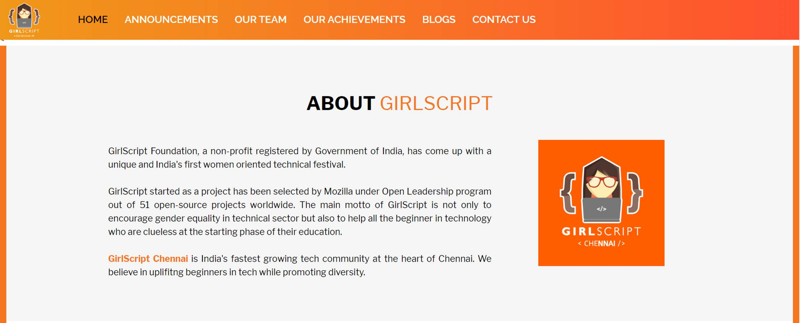

# 🙆 GirlsScript Chennai Website


[](https://gitter.im/girlscript_chennai_website/community?utm_source=badge&utm_medium=badge&utm_campaign=pr-badge)

This is the website meant to serve the Chennai chapter of GirlScript Chennai. 

## 🙇 Description
Being an open source project under GirlScript Summer of Code'2020, this website is not only built for the community but also by the community as well. This is a good starting point for anyone new to web development to work on an actual use case.
### 👀 Sections of the website:

- Home 
- Annoucements 
- Achievements 
- Team 
- Contact Us

Also for participants looking to contribute beyond just the website...we shall have a separate projects folder..for making certain small scripts to assist the admins of the website..Once approved here and verified..you can directly contribute the same.
https://github.com/girlscriptchennai

### 👇 Checkout the current version: 

[Community Website Boilerplate](https://girlscriptchennai.netlify.com/)

## 📷 Snapshots



## 📚 Tech Stack Used
1. HTML
2. CSS
3. JavaScript

## 👇 Prerequisites to contribute

- Basic knowledge of HTML, CSS and JavaScript for frontend.
- The ability to use Git and GitHub.
- Knowing React and Gatsby is big plus.
- UI/UX Design skills are appreciated but not mandatory.
- Some idea about Firebase or willingness to learn it.
- NodeJS should be installed (check for it's installation on terminal using npm -v)


## 🏆 How to contribute


**1.** Fork [this](https://github.com/smaranjitghose//girlscript_chennai_website) repository.

**2.** Clone the forked repository.
```terminal
git clone https://github.com/<your-github-username>//girlscript_chennai_website
```

**3.** Navigate to the project directory.
```terminal
cd /girlscript_chennai_website
```

**4.** Create a new branch.
```terminal
git checkout -b <your_branch_name>
```

**5.** Make changes in source code.

**6.** Commit your changes.

```terminal
  git add .
  git commit -m "<your_commit_message>"
```

**7.** Push your local branch to the remote repository.
```terminal
git push -u origin <your_branch_name>
```

**8.** Create a Pull Request!

**9.** **Congratulations!** Sit and relax, you've made your contribution to [GirlScript Chennai Website](https://github.com/smaranjitghose//girlscript_chennai_website) project. Wait for your PR to be reviewed by the mentors.


## 📝 Resources to get started with:

- [freecodecamp Curriculum + Blogs](https://www.freecodecamp.org/)
- [w3Schools](https://www.w3schools.com/)

## 🔥 Code of Conduct
In order to promote an open and welcoming atmosphere, we as contributors and maintainers commit ourselves to make involvement in our project and in our group a harassment-free experience for all irrespective of age, body size, disability, ethnicity, gender identity and expression, level of experience, nationality, personal appearance, race, religion, or sexual identity and orientation.
### Our Standards
* There should be clear communication.
* Listen to everyone's ideas.
* Learn all the aspects before coming to conclusion.
* Using inoffensive language
* Attaining positive work environment should be one of everybody's goals
### Our Responsibilities
Authorities are responsible for creating an environment where everyone is treated equally and strict actions should be taken in case of unacceptable behaviour.
Authorities have the duty and responsibility to delete, modify, or reject comments, code, wiki updates, problems, and other contributions that are not consistent with this Code of Conduct, or temporarily or permanently ban any user for other actions that they find unacceptable, disruptive, offensive, or harmful.

## 👨 Project Admin

- [Smaranjit Ghose](https://github.com/smaranjitghose)

## 👬  Mentors

- [Sukkrit Sharma](https://github.com/sukkritsharmaofficial)
- [Saswat Nayak](https://github.com/swat1998)
- [Ousnik Polley](https://github.com/ousnik)

Feel free to ask your queries!! 🙌

## License 📝
Refer to [LICENSE](./LICENSE).

Happy Coding!! 💜💜

