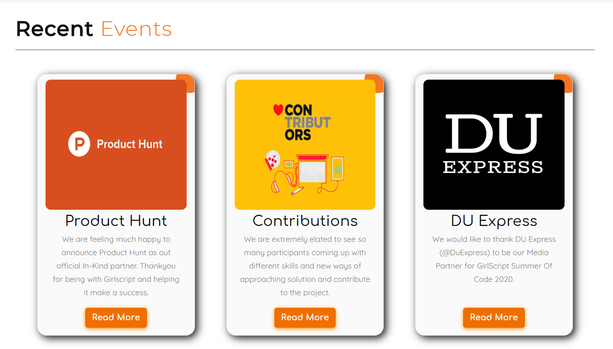

.. role:: python(code)
    :language: python

Announcement Page
==================

This page consists of the announcements about upcoming events and recent events by your Girlscript Chapter.
It consists of 2 sections which are as follows:

1. **Upcoming events**: This section consists of the upcoming events in a timeline format.

.. image:: ./images/announcementpage/upcomingevent.JPG
  :width: 600
  :align: center
  :alt: Alternative text

If you want to make changes in this section, carry out the following changes in code:

- To make changes in the heading - Go to `announcements.html <https://github.com/smaranjitghose/girlscript_chennai_website/blob/master/announcements.html>`__ and search :python:`Upcoming`, you will see <h2> tag where you can make changes.

* To make changes in the content of cards - Go to `announcements.html <https://github.com/smaranjitghose/girlscript_chennai_website/blob/master/announcements.html>`__ and search :python:`timeline-content`, you will see <h2> and 
 tags where you can make changes in the heading and the description respectively.

- To make changes in the button - Go to `announcements.html <https://github.com/smaranjitghose/girlscript_chennai_website/blob/master/announcements.html>`__ and search :python:`card-stats`, you will see <a> tag where you can change the path in the href.

* To add an additional event - Go to `announcements.html <https://github.com/smaranjitghose/girlscript_chennai_website/blob/master/announcements.html>`__ and search :python:`timeline-container right` where you can copy the whole 
 and just replace the :python:`right` class with :python:`left` so that the added card is shown on the left hand side, then you can change it's heading and description of the event under <h3> and 
 page respectively.

- To add the time of the event - Go to `announcements.html <https://github.com/smaranjitghose/girlscript_chennai_website/blob/master/announcements.html>`__ and search :python:`time` where you can change the date accordingly.

2. **Recent events**: This section consists of the  recent events that are being conducted by your GirlsScript.

If you want to make changes in this section, carry out the following changes in code:

- To make changes in the heading - Go to `announcements.html <https://github.com/smaranjitghose/girlscript_chennai_website/blob/master/announcements.html>`__ and search :python:`Recent`, you will see <h2> tag where you can make changes.

* To modify the images in the cards - Go to `announcements.html <https://github.com/smaranjitghose/girlscript_chennai_website/blob/master/announcements.html>`__ and search :python:`card-image`, you will see  tag where inside href you have to change the path of the new image.

- To modify the heading and content of the card - Go to `announcements.html <https://github.com/smaranjitghose/girlscript_chennai_website/blob/master/announcements.html>`__ and search :python:`card-text` then you can change it's heading and description under <h2> and 
 page respectively.

* To make changes in the button - Go to `announcements.html <https://github.com/smaranjitghose/girlscript_chennai_website/blob/master/announcements.html>`__ and search :python:`card-stats`, you will see <a> tag where you can change the path in the href.

- To add an additional event - Go to `announcements.html <https://github.com/smaranjitghose/girlscript_chennai_website/blob/master/announcements.html>`__ and search :python:`card r-events-card` where you can copy the whole 
 and change it's heading and description under <h2> and 
 page accordingly.
