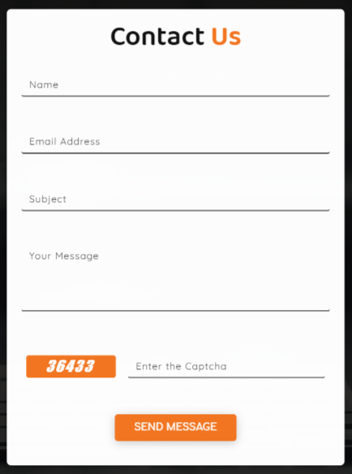

.. role:: python(code)
    :language: python

Contact us Page
==================

This page shows the user how they can reach the Girlscript Community.
It consists of 2 sections which are as follows:

1. The left section consists of the **contact** and the **address details**.

.. image:: ./images/contactuspage/Information.PNG
  :width: 400
  :align: center
  :alt: Alternative text

If you want to make changes in this section, carry out the following changes in code:

- To make changes in the heading : Go to `contactUs.html <https://github.com/smaranjitghose/girlscript_chennai_website/blob/master/contactUs.html>`__ and search :python:`def`, you will see <h4> tag where you can make changes.

* To make changes in the description : Go to `contactUs.html <https://github.com/smaranjitghose/girlscript_chennai_website/blob/master/contactUs.html>`__ and search :python:`def-sec`, you will see 
 where you can make changes.

- To modify the icon : Go to `contactUs.html <https://github.com/smaranjitghose/girlscript_chennai_website/blob/master/contactUs.html>`__  and search :python:`fa`, you will see <i> tag where you can modify the class with your chosen icon.

* To add any other information : Go to `contactUs.html <https://github.com/smaranjitghose/girlscript_chennai_website/blob/master/contactUs.html>`__ and search :python:`def` , where you can copy the whole 
 and make changes accordingly.

- To change the background image : Go to `contact-page.css <https://github.com/smaranjitghose/girlscript_chennai_website/blob/master/css/contact-page.css>`__ and search :python:`.main-section`, in the url change the link to a different image. You can add new image in the :python:`../assets/Images/contact/image_name` and then add this link in the url.

2. The right section consists of the **contact form** where the user can submit their queries.

If you want to make changes in this section, carry out the following changes in code:

- To make changes in the heading : Go to `contactUs.html <https://github.com/smaranjitghose/girlscript_chennai_website/blob/master/contactUs.html>`__ and search :python:`form-heading`, you will see <h2> tag where you can make changes. 

* To change the placeholder of the input field : Go to `contactUs.html <https://github.com/smaranjitghose/girlscript_chennai_website/blob/master/contactUs.html>`__ and search :python:`form-control-placeholder`, where in <label> tag you can make changes. 

- To change the type of the input field : Go to `contactUs.html <https://github.com/smaranjitghose/girlscript_chennai_website/blob/master/contactUs.html>`__ and search :python:`form-control no-border`, you will see <input> tag where in type you change it accordingly. 

* To add another input field : Go to `contactUs.html <https://github.com/smaranjitghose/girlscript_chennai_website/blob/master/contactUs.html>`__ and search :python:`form-group pb-3`, where you can copy the whole 
 and make changes according to your requirement.

- To modify the text in the button : Go to `contactUs.html <https://github.com/smaranjitghose/girlscript_chennai_website/blob/master/contactUs.html>`__ and search :python:`submit-button`, you will see <button> tag where you can make changes. 

* To modify the validation of the input field : Go to `contactUs.js <https://github.com/smaranjitghose/girlscript_chennai_website/blob/master/scripts/contactUs.js>`__ and search :python:`validateForm` and add the desired restrictions.

.. note::

   - You can refer `this <https://fontawesome.com/v4.7.0/icons/>`__  where you can get different icons according to your requirement and you can copy the html code of the icon to add it in the code and do the further designing.

   - To study about various input types in form refer `this <https://www.w3schools.com/html/html_form_input_types.asp>`__ .

   - You can refer `this <https://www.tutorialspoint.com/javascript/javascript_form_validations.htm>`__ for adding javascript form validation
