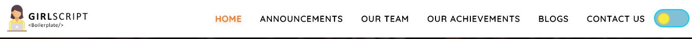

  .. role:: python(code)
    :language: python

Header and Footer Section
==========================

1. **Header**: This section contains the navbar that has the links to other sections of the website.

There are 2 sections within the navbar
a) Navbar (Laptop View) : 

If you want to make changes in this section, carry out the following changes in code:

- To change the logo :  Go to file `app.js <https://github.com/smaranjitghose/girlscript_chennai_website/blob/master/scripts/app.js>`__ and search :python:`navbar-brand`, you will see   tag where in src you can set the path of the new image.

* To modify the navbar items : Go to file `app.js <https://github.com/smaranjitghose/girlscript_chennai_website/blob/master/scripts/app.js>`__ and search :python:`nav-link`, you will see  tag where you can make changes.

- To change the link of navbar items : Go to file `app.js <https://github.com/smaranjitghose/girlscript_chennai_website/blob/master/scripts/app.js>`__ and search :python:`nav-link`, you will see <a> tag where in href you can make changes.

* To append an additional navbar item : Go to file `app.js <https://github.com/smaranjitghose/girlscript_chennai_website/blob/master/scripts/app.js>`__ and search :python:`nav-item`, where you can copy the <li> tag and make the changes accordingly.

b) Full Screen Navigation (Responsive View) :

.. image:: ./images/headerfooter/headerfullnav.JPG
  :width: 600
  :align: center
  :alt: Alternative text

If you want to make changes in this section, carry out the following changes in code:

- To change the svg image :  Go to file `app.js <https://github.com/smaranjitghose/girlscript_chennai_website/blob/master/scripts/app.js>`__ and search :python:`svg-img`, you will see  <svg> tag where you can modify it.

* To modify the navbar items : Go to file `app.js <https://github.com/smaranjitghose/girlscript_chennai_website/blob/master/scripts/app.js>`__ and search :python:`navigation-content`, you will see <a> tag where you can make changes.

- To change the link of navbar items : Go to file `app.js <https://github.com/smaranjitghose/girlscript_chennai_website/blob/master/scripts/app.js>`__ and search :python:`navigation-content`, you will see <a> tag where in href you can make changes.

* To append an additional navbar item : Go to file `app.js <https://github.com/smaranjitghose/girlscript_chennai_website/blob/master/scripts/app.js>`__ and search :python:`navigation-content`, where you can copy the <a> tag and make the changes accordingly.

.. note::

   - You can refer `this <https://fontawesome.com/v4.7.0/icons/>`__  where you can get different icons according to your requirement and you can copy the html code of that icon and add it into your code and do the further designing.
   
   
