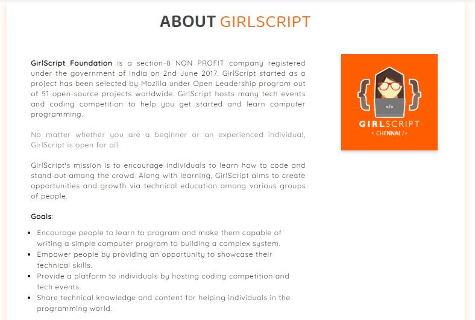

Home Page
===================

This is the landing page of our website which includes the introduction, goals, achievement etc.
The home page is divided into various sections which are as follows:

1. **Carousel**: A carousel is a set of rotating banners, or a slideshow, that displays on the homepage of your store. It allows you to display up to five slides consisting of images and text, which can be linked to specific products or pages. The image will change every few seconds.
We have added the background image to the moving slides, and the display text above it is "WELCOME TO GIRLSCRIPT CHENNAI".

.. image:: ./images/homepage/carousel.JPG
  :width: 600
  :align: center
  :alt: Alternative text

To make any changes in the code follow the below steps.

- To change the background image - Go to file *style.css* and search ".slide1" in the url change the link to a different image. You can add new image in the *../assets/Images/carousel/image_name* and then add this link in the url. Similarly you can search for ".slide2" and modfify it. 

- To change the carousel content - Go to file *index.html* and search "carousel-content", you will see <h1> and <h2> tag where you can modify your content accordingly. 

- To change the color of the carousel content - Go to file *style.css* and search ".main-head" or ".sub-head" where you will see the color field and you can change it there.

.. note::
   In visual code studio, To search for a word press *ctrl + f* and for a file press *ctrl + p* 
   

2. **About**: About section describes about the Girlscript Foundation and their goals.

To make any changes in the code follow the below steps :

- To change the content - Go to file *index.html* and search "about-para" where you can change it.

- To change the color of the heading and that of inner content part - Go to file *style.css* and search ".heading" where you can modify it. Similarly you can search ".about-para", you will see 
 tag where you can modify your content accordingly.

- To add or modify the points in the Goals section - Go to file *index.html* and search "Goals", you will see <li> tag (which is used for those black dots) within which you can change it's content accordingly.

- To change the image - Go to file *index.html* and search ".img-logo", you will see the  tag and in src you can change the image.

- To change the box-shadow of the card - Go to the file *style.css* and search ".myDiv" where you can change the box-shadow by giving appropriate size and color to it.

3. **Parallax**: Parallax scrolling is when the website layout sees the background of the web page moving at a slower rate to the foreground, creating a 3D effect as you scroll. Used sparingly it can provide a nice, subtle element of depth that results in a distinctive and memorable website.

.. image:: ./images/homepage/parallax.JPG
  :width: 600
  :align: center
  :alt: Alternative text

- To add some different image go to *style.css* and search ".parallax1" and change the url. 

.. note::
   There are three Parallax in the home page.

4. **Our Initiatives**:

5. **Our Achievements**:

6. **Various Trends**:

