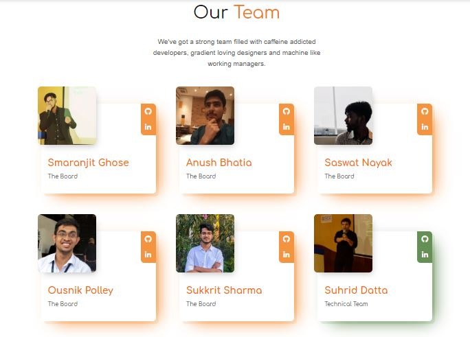

.. role:: python(code)
    :language: python

Team Page
=================

This page consists of the member which are working behind the project so that all the contributors can work on it smoothely.

If you want to make changes in this section, carry out the following changes in code:

- To make changes in the heading - Go to `team.html <https://github.com/smaranjitghose/girlscript_chennai_website/blob/master/team.html>`__ and search :python:`teamHeading`, you will see <h1> tag where you can make changes.

* To make changes in the subheading - Go to `team.html <https://github.com/smaranjitghose/girlscript_chennai_website/blob/master/team.html>`__ and search :python:`team-description`, you will see <h4> tag where you can make changes.

- To modify the images in the card - Go to `team.html <https://github.com/smaranjitghose/girlscript_chennai_website/blob/master/team.html>`__ and search :python:`gs-team-member-image`, you will see  tag where inside href you have to change the path of the new image.

* To modify the name and the position in the card - Go to `team.html <https://github.com/smaranjitghose/girlscript_chennai_website/blob/master/team.html>`__ and search :python:`gs-team-member-info`, you will see 
 where you can make changes.

- To make changes in the social links in the card - Go to `team.html <https://github.com/smaranjitghose/girlscript_chennai_website/blob/master/team.html>`__ and search :python:`gs-team-member-social` , you will see <a> tag where inside href you can change the link and in the <i> tag you can change the icon.

* To add an additional social link in the card - Go to `team.html <https://github.com/smaranjitghose/girlscript_chennai_website/blob/master/team.html>`__ and search :python:`gs-team-member-social` , you can copy <a> tag and make the changes within it accordingly.

- To add an additional team member - Go to `team.html <https://github.com/smaranjitghose/girlscript_chennai_website/blob/master/team.html>`__ and search :python:`gs-team-member` , you can copy the whole 
 and make the changes within it accordingly and also give it the required class like :python:`gs-team--board` (gs-team--"teamCategory") so that it can be distinguished. 

.. note::

   - In order to get different icons for your social media, you can prefer `this <https://fontawesome.com/v4.7.0/icons/>`__  where you can search and copy the html code of that icon to your code.

